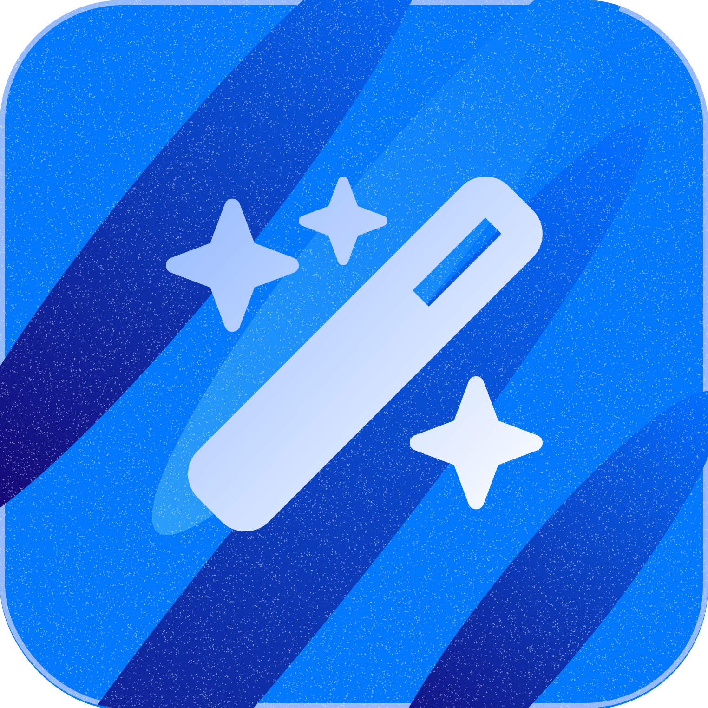

<br />
<p align="center">
  <a href="https://github.com/synapsy-ai/genidoc">
    
  </a>
  <h1 align="center">Synapsy Genidoc</h1>

  <p align="center">
    Create markdown documentations using the power of AI.
    <br />
    <a href="https://genidoc.peyronnet.group"><strong>Launch »</strong></a>
    <br />
    <a href="https://github.com/synapsy-ai/genidoc/issues/new?assignees=&labels=bug&template=bug-report.yml&title=%5BBug%5D+">Report Bug</a>
    ·
    <a href="https://github.com/synapsy-ai/genidoc/issues/new?assignees=&labels=enhancement&template=feature-request.yml&title=%5BEnhancement%5D+">Request Feature</a>
    ·
    <a href="https://github.com/synapsy-ai/genidoc/issues?q=is%3Aopen+is%3Aissue+label%3Abug">Known Issues</a>

  </p>
</p>

## Overview

Synapsy Genidoc is a powerful Next.js application designed to streamline the process of generating Markdown documentation for your code. Leveraging the capabilities of OpenAI's GPT models, this tool allows developers to effortlessly create comprehensive documentation with just a few clicks.

## How it Works

1. **Create a Template:**

   - Click on the "Create template" button to initiate the template creation process.
   - Provide a name for your template.
   - Enter a Markdown code template that represents the structure you want for your documentation.
   - Specify the programming language for the code template.

2. **Select Template:**

   - Choose the template you created from the available options.

3. **Enter Code:**

   - Input the code you want to document in the language you previously specified.

4. **API Key Requirement:**

   - Note that an OpenAI API key is required for the tool to function. Ensure you have a valid API key before proceeding.

5. **Generate Documentation:**
   - Click on the "Generate" button.
   - Synapsy Genidoc will process the provided code using OpenAI's GPT models.
   - The app will return the generated Markdown documentation for the provided code.

## Getting Started

### Prerequisites

- OpenAI API key (Sign up on [OpenAI](https://openai.com/signup/) to obtain your key)
- Node.js and npm installed on your machine

### Installation

1. Clone the repository:

   ```bash
   git clone https://github.com/synapsy/genidoc.git
   ```

2. Navigate to the project directory:

   ```bash
   cd synapsy-genidoc
   ```

3. Install dependencies:

   ```bash
   npm install
   ```

4. Start the development server:

   ```bash
   npm run dev
   ```

5. Access the application at [http://localhost:3000](http://localhost:3000) in your browser.

## Contributing

Contributions are welcome! If you'd like to contribute to Synapsy Genidoc, please follow our [contribution guidelines](CONTRIBUTING.md).

## License

This project is licensed under the MIT License - see the [LICENSE](LICENSE) file for details.
